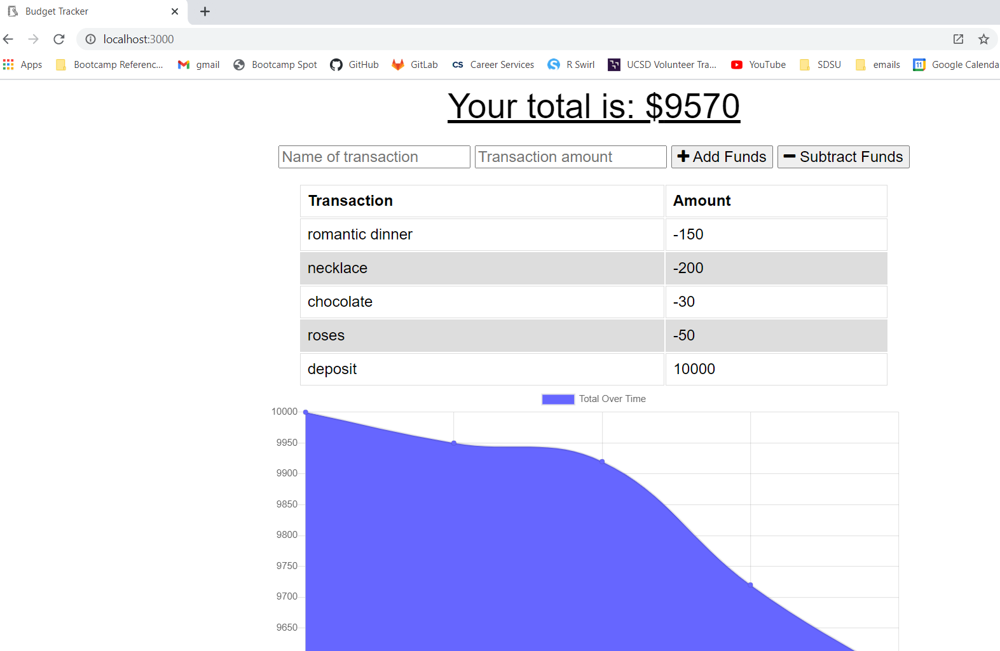
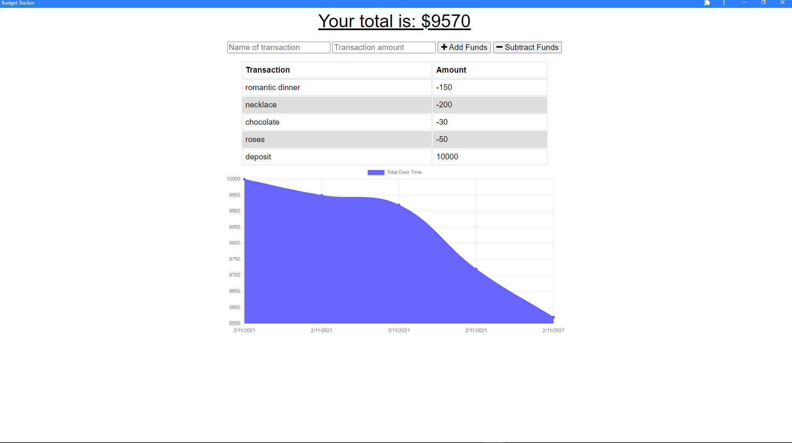

  # Budget Trackers Offline & PWA Enabled
  
  

  deployed app: [click here](https://dry-peak-21916.herokuapp.com/)

  ### Launch page:
  

  ### PWA:
  

  ## Table of contents
  ​
  
  - [Description](#Descriptionn)
  - [Installation](#Installation)
  - [Usage](#Usage)
  - [Testing](#Testing)
  - [License](#License)
  - [Questions?](#Questions?)
  

  ## Description
  
  This app allows inputting expenditures and deposits, and makes a graph of the values, based on time. The front-end and backend adding to MongoDB were provided via template, whereas both IndexedDb was added to store offline pending transactions. These transactions are then added to MongoDB upon going online again. Basic criteria to download website as a PWA app was also added
  
  ## Installation
  
  this website is hosted on Heroku (https://dry-peak-21916.herokuapp.com/); to make a copy of this app, download files from GitHub, then run ` npm i` from the CLI terminal on the root directory.
  
  ## Usage
  
  simply run ` npm start` from the CLI terminal, then go to the localhost indicated in the terminal. On the actual site, inputting both a name for the transaction, amount, and then clicking 'Add Funds' or 'Subtract Funds' will add the transaction to the database, as well as adding the transaction to the chart
  
  ## Testing
  
  no tests currently for this app (coming soon!)
  
  ## License
  
  This project is licensed under the MIT
  
  ## Questions?
  
  If you have any questions or comments, please contact me using one or more of the following:
  
  Github Profile: [https://github.com/anzelcapparelli](https://github.com/anzelcapparelli)

  Email: anzelcapparelli@gmail.com

